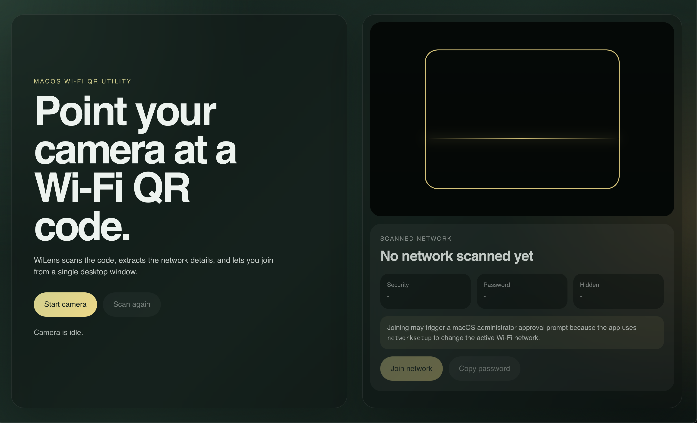

# WiLens

WiLens is a macOS desktop app that scans a Wi-Fi QR code and joins the network.

## What It Does

1. Opens the camera in a desktop window.
2. Scans a standard Wi-Fi QR code.
3. Shows the network before joining.
4. Joins the network via CoreWLAN — no administrator prompt — and falls back to
   `networksetup` only if that can't connect.

Example QR payload:

```txt
WIFI:T:WPA;S:MyWifi;P:mypassword;;
```

## Download

Grab the latest macOS build from the
[Releases page](https://github.com/whereissam/WiLens/releases/latest)
(`WiLens.dmg`). Apple Silicon only. The app is unsigned, so on first launch
right-click **WiLens → Open** to get past Gatekeeper.

## Current Status

WiLens joins Wi-Fi via CoreWLAN (no administrator prompt), verifying the
connection and falling back to `networksetup` if needed. Local builds produce:

- `src-tauri/target/release/bundle/macos/WiLens.app`
- `src-tauri/target/release/bundle/dmg/WiLens_<version>_aarch64.dmg`

## Screenshot



## Run

Open the built app:

```bash
open src-tauri/target/release/bundle/macos/WiLens.app
```

Run the development build:

```bash
bun install
cargo tauri dev
```

Build production again:

```bash
cargo tauri build
```

Build and produce the release installer named `WiLens.dmg` (what the download
page links to) in one step:

```bash
bun run release:dmg
```

## Permissions

- **Camera** — to scan the QR code.
- **Location** — macOS requires Location access before *any* app can scan for
  Wi-Fi networks, so it asks the first time you open WiLens. WiLens uses it only
  to find and join your network; it never collects, stores, or shares your
  location. Granting it lets WiLens join quietly with no administrator prompt.

## Notes

- WiLens currently targets macOS (Apple Silicon).
- If Location is denied or the quiet join can't connect, WiLens falls back to the
  `networksetup` tool, which shows a macOS administrator approval prompt.
- All permission prompts are controlled by macOS, not by the app UI.

## Security & Privacy

WiLens runs entirely on your Mac — no servers, no accounts, no tracking, and no
network calls of its own. Camera images, network names, and passwords never leave
your computer. See [SECURITY.md](SECURITY.md) for the full breakdown and how to
verify it yourself.

## Project Docs

- [Product scope and architecture](docs/product-scope.md)
- [Usage guide](docs/usage.md)
- [Implementation TODO](docs/todo.md)

## License

[MIT](LICENSE) © whereissam
